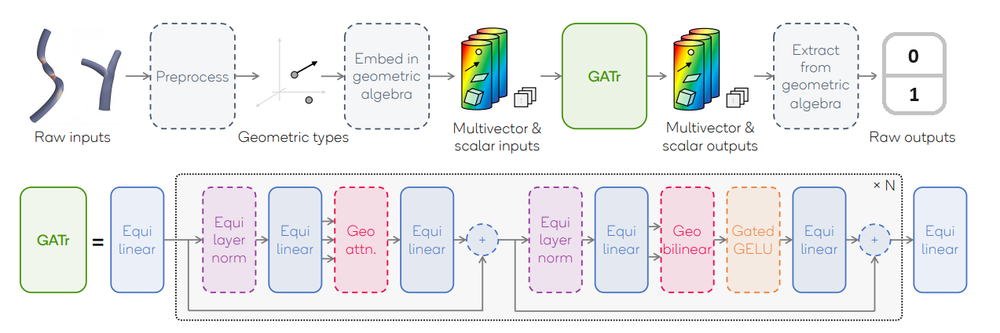

# Geometric Transformers

## Abstract

The "Geometric Transformers" project is dedicated to the development of a Transformer-based architecture designed specifically for handling geometric data. The primary objective is to create a model tailored for the classification of arteries, with a particular focus on identifying stenosis or bifurcation. To achieve this, the model needs to adeptly recognize crucial features in the input data and represent inputs, outputs, and hidden states within a projective geometric algebra framework.

## Dataset
The dataset is available at the following [**link**](https://drive.google.com/drive/folders/1sN_5UvsizXUybEw3PpSLkJTtWEoECkQh?usp=sharing)

## Objectives

1. **Artery Classification**: The core goal of the project is to build a robust model capable of accurately classifying arteries based on the presence of stenosis or bifurcation.

2. **Feature Identification**: The model should effectively identify and leverage essential features within the input geometric data to enhance classification accuracy.

3. **Geometric Algebra Framework**: Representation of inputs, outputs, and hidden states within a projective geometric algebra framework is crucial for the success of the model. This ensures a mathematically sound approach to handling geometric data.

4. **Symmetry Assessment**: To evaluate the model's ability to capture symmetries in the data, the project will delve into symmetry group operations. This involves testing the model's equivariance by applying symmetry group operations and analyzing its response.

## Methodology

The development of the "Geometric Transformers" project follows these key steps:

1. **Data Preprocessing**: Prepare the geometric data, emphasizing feature extraction and ensuring compatibility with the projective geometric algebra framework.

2. **Model Architecture**: Design and implement a Transformer-based architecture that is optimized for handling geometric data, taking into account the specific requirements of artery classification.

3. **Training and Evaluation**: Train the model using annotated datasets and evaluate its performance using appropriate metrics. Iteratively refine the model to achieve optimal results.

4. **Geometric Algebra Integration**: Implement mechanisms to represent inputs, outputs, and hidden states within a projective geometric algebra framework, ensuring a coherent mathematical foundation.

5. **Symmetry Analysis**: Investigate symmetry group operations and assess the model's equivariance by testing its response to different symmetry transformations.

## Usage

To utilize the "Geometric Transformers" project, follow these steps:

1. **Install Dependencies**: Ensure all required dependencies are installed. Detailed instructions can be found in the project documentation.

2. **Data Input**: Prepare geometric data in the specified format as outlined in the documentation.

3. **Training**: Train the model using the provided training scripts. Adjust hyperparameters as needed.

4. **Evaluation**: Evaluate the model's performance using the provided evaluation scripts and metrics.
